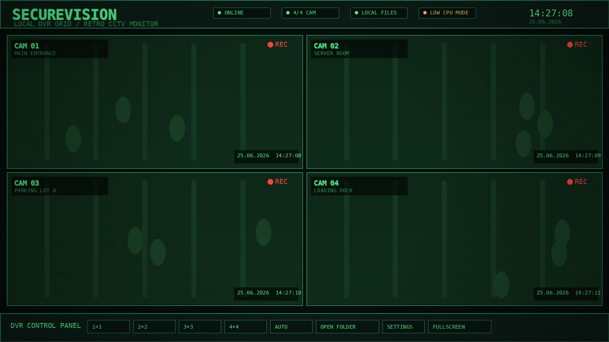
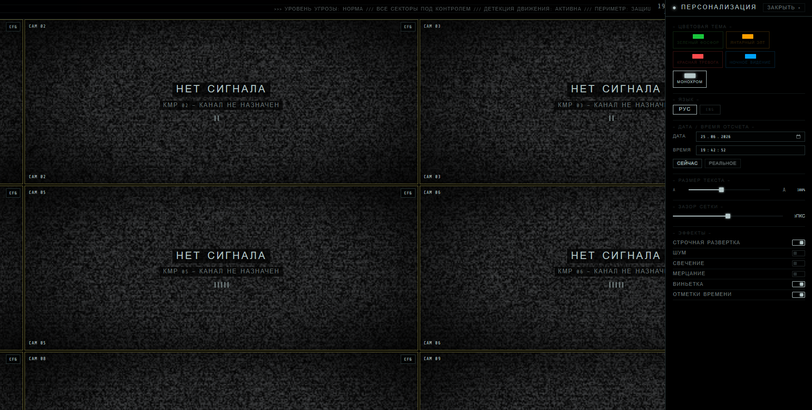
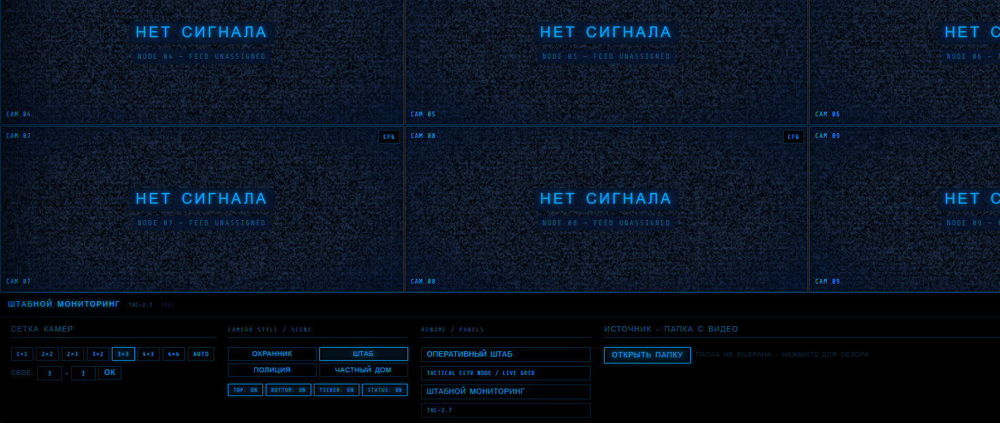

<div align="center">

# CCTV Monitor

**Retro CCTV / DVR dashboard for local video playback, camera grids, and cinematic surveillance screens.**

[](https://nextjs.org/)
[](https://react.dev/)
[](https://www.typescriptlang.org/)
[](https://tailwindcss.com/)
[](https://cctv-blond.vercel.app/)
[](#local-video-privacy)
[](#performance)

</div>

---

## Screenshots

### Dashboard



### Personalization panel



### Low-power playback mode



---

## What is this?

**CCTV Monitor** is a browser-based surveillance grid interface designed for film props, screen inserts, local playback, and quick CCTV-style mockups.

It is intentionally simple: open a folder with local videos, choose a grid, tune the look, and run it fullscreen. The site does not need a backend for playback and does not upload selected videos anywhere.

---

## Features

- Local video folder playback.
- 1×1, 2×2, 2×3, 3×2, 3×3, 4×3, 4×4, custom, and auto grids.
- Drag-and-drop camera ordering.
- Fullscreen monitor mode.
- Per-camera labels and location tags.
- Per-camera aspect ratio, brightness, contrast, fisheye, and noise controls.
- CCTV timestamp overlays.
- Scene presets:
  - Guard room / analog DVR
  - HQ / tactical node
  - Police dispatch
  - Private house camera system
- Local settings persistence.
- Reset button for restoring the default look.
- Custom colors for interface and camera elements.
- Text and UI scaling controls.
- Performance mode for older machines and weak CPUs.

---

## Local video privacy

Videos are selected through the browser file picker and played from local `blob:` URLs.

That means:

- files are not uploaded to a server;
- Vercel does not receive the video files;
- the app only keeps display settings in browser storage;
- after a full reload, the browser may require selecting local video files again.

This is a browser security limitation, not an app bug.

---

## Performance

The dashboard is built for machines that may be used on set, including old laptops and weak office PCs.

Performance-focused behavior includes:

- staggered video startup instead of launching every `<video>` at once;
- shared timestamp ticking instead of one React interval per camera;
- lighter effects in dense grids;
- safer `blob:` URL handling;
- reduced animation pressure in low-power mode;
- automatic performance mode for weak devices and 3×3+ grids.

For the smoothest playback on old machines:

1. Prefer `mp4 / h.264`.
2. Keep video resolution close to the final cell size.
3. Use 2×2 or 3×3 instead of 4×4 on very weak CPUs.
4. Disable noise, glow, flicker, and vignette when decoding starts to struggle.

---

## Tech stack

| Layer | Tool |
|---|---|
| Framework | Next.js 16 |
| UI runtime | React 19 |
| Language | TypeScript |
| Styling | Tailwind CSS 4 |
| Deployment | Vercel |
| Storage | `localStorage` for settings |

---

## Getting started

```bash
pnpm install
pnpm dev
```

Open:

```text
http://localhost:3000
```

Build:

```bash
pnpm build
pnpm start
```

Lint:

```bash
pnpm lint
```

---

## Usage

1. Open the site.
2. Press **OPEN FOLDER** and select a folder with local videos.
3. Choose the grid size.
4. Open **SETTINGS** to adjust the interface style.
5. Use **CFG** on a camera cell to tune that camera.
6. Press **FULLSCREEN** for playback.

---

## Settings

Global settings are saved locally in the browser:

- color theme;
- custom element colors;
- text scale;
- UI scale;
- grid gap;
- scanlines;
- noise;
- glow;
- flicker;
- vignette;
- timestamp visibility;
- panel visibility;
- scene style;
- custom titles.

Camera settings are also persisted locally:

- label;
- location;
- aspect ratio;
- brightness;
- contrast;
- fisheye;
- noise intensity.

Use **RESET** in the personalization panel to restore defaults.

---

## Repository structure

```text
app/
  globals.css
  layout.tsx
  page.tsx

components/
  cctv/
    CCTVGrid.tsx
    CCTVHeader.tsx
    CameraSettings.tsx
    ControlPanel.tsx
    NoSignal.tsx
    ThemeSettingsPanel.tsx
    TimestampOverlay.tsx
    VideoCell.tsx

lib/
  themeContext.tsx

docs/
  screenshots/
    dashboard.png
    settings.png
    performance.png
```

---

## Deployment

The public deployment is available here:

```text
https://cctv-blond.vercel.app/
```

Recommended Vercel settings:

```text
Framework Preset: Next.js
Install Command: pnpm install
Build Command: pnpm build
Output Directory: .next
```

---

## Notes

This project is a visual CCTV simulator, not a real surveillance system. It is designed for local playback, film inserts, UI mockups, and controlled screen use.

